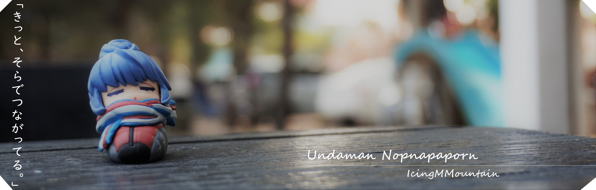
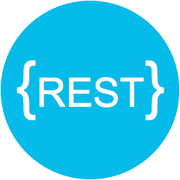

 Hi! My name is Undaman Nopnapaporn. Thank You for taking the time to view my GitHub Profile 😉

	
<h2> About Me </h2>

- 📱 Android Developer at ODDS 

- 📚 I'm studying in Master of Science Information Technology and Digital Innovation.

- ⛩️ I'm currently learning Japanese.

- 💬 Talk to me about Python, JavaScript, React, Android Kotlin... 
	
<h2> Experience  </h2>

**I can learn new language , framework , library , and tool very fast.**

	
<h3> Languages </h3>

 

 
<h3> Frameworks </h3>

 
<h3> CSS frameworks </h3>

 
<h3> Tools </h3>

 
<h3> And More... </h3>

 
<h3> And Other <h3>

<!--Social Links Badges: start-->

<h2> Connect with me  </h2>

<!--Social Links Badges: end-->

<!--Statistics: start-->

  
  

<!--Statistics: end-->
